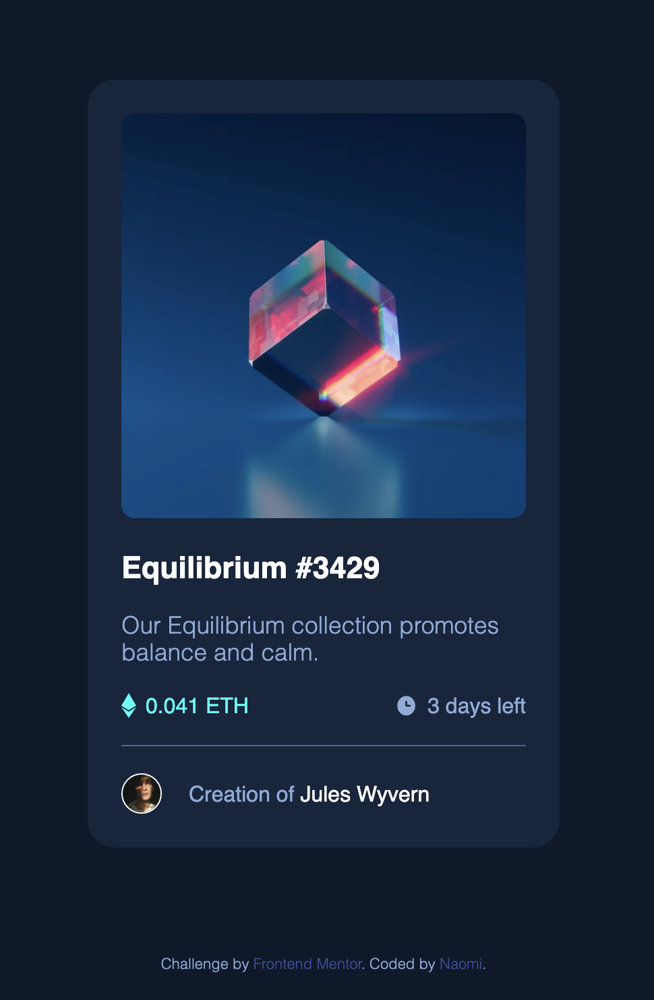

# Frontend Mentor - NFT preview card component solution

This is a solution to the [NFT preview card component challenge on Frontend Mentor](https://www.frontendmentor.io/challenges/nft-preview-card-component-SbdUL_w0U). Frontend Mentor challenges help you improve your coding skills by building realistic projects. 

## Table of contents

- [Overview](#overview)
  - [The challenge](#the-challenge)
  - [Screenshot](#screenshot)
  - [Links](#links)
- [My process](#my-process)
  - [Built with](#built-with)
  - [What I learned](#what-i-learned)
- [Author](#author)

## Overview

### The challenge

Users should be able to:

- View the optimal layout depending on their device's screen size
- See hover states for interactive elements

### Screenshot



### Links

- Solution URL: [https://github.com/naomichoe/NFT-preview-card.git]
- Live Site URL: [https://naomichoe.github.io/NFT-preview-card/]

## My process

### Built with

- HTML5 
- CSS

### What I learned

I learned how to successfully add an image overlay. Slightly challenging getting the position right of the overlay image but was successful in getting it where I wanted.

To see how you can add code snippets, see below:

```css
div.main-img-container img#hover-img {
    width: 100%;
    position: absolute;
    top: 0;
    left: 0;
    border-radius: 10px;
    background: rgb(0, 0, 0);
    background: rgba(0, 255, 247, 0.5);
    transition: .5s ease;
    opacity:0;
    padding: 120px;
    cursor: pointer;
}
```

## Author

- Github - [https://github.com/naomichoe]
- Frontend Mentor - [@naomichoe](https://www.frontendmentor.io/profile/naomichoe)
